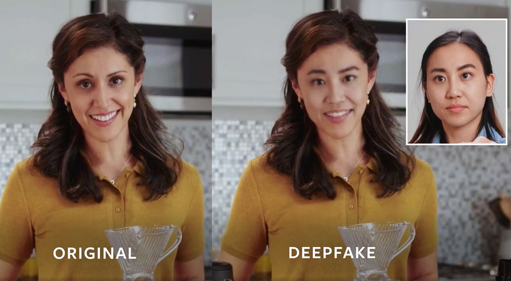

# Fake Video Detection



Hello! Here is my personal submission for an object detection task for Brainhack's [SeeTrue Workshop](https://www.dsta.gov.sg/brainhack) hackathon.

My implementation makes use of [InceptionV3](https://keras.io/api/applications/inceptionv3/). InceptionV3 is a convolutional neural network using the 3rd iteration of Google's Inception architecture, comprising inception modules which allow it to achieve high classification accuracy at low computation time. More on the Model Architecture [here](https://arxiv.org/abs/1512.00567).

with a ResNet50-FPN backbone. To understand the underlying code structure, you can read this [article](https://zhuanlan.zhihu.com/p/145842317) by translating to English.

Through robust augmentations and hyperparameter tuning, I was able to achieve an average log loss of 0.3225 on unseen photos.

# Use my implementation

### Downloading my Source Code
- Visit the [repository](https://github.com/raythx98/Fake-Video-Detection)
- Click on `Fake Video Detection.ipynb`
- Click on the download button

### Upload the Jupyter Notebook
- Upload the Jupyter Notebook to your google drive
- Note: `/content/drive/MyDrive` is your google drive home directory
- Open the Jupyter Notebook
- Change your runtime by following these steps
    1. Click on `runtime`
    2. Click on `change runtime type`
    3. Change hardware accelerator to `GPU`

### Configure the Notebook
- Open the Jupyter Notebook
- Under `Import dataset`, change `base_folder` to your desired path
- rename the zip file for `dataset_path` and `testing_path`, more on creating your dataset [below](#creating-your-datasets)

### Creating your datasets

#### Dataset format
Your datasets `dataset.zip` and `testing.zip` should follow the following format:

> Note that training data have to be preprocessed, this notebook assumes that you have preprocessed your videos into multiple frames (approximately 20) and formatted them into .jpg files.

> However, if your data is not processed - don't worry! There are helper methods defined under `Helper Methods` at the bottom of the Notebook, such as `Frame Extraction` and `Face Extraction`, to help you preprocess your video files easily!

> In `testing.zip`, Both images and videos must be present, even though the prediction is made for individual frames, we will need the video to aggregate for the final prediction.

```
dataset.zip/
    dataset/
        train/
            fake_image/
            .   00001/
            .   .  frame00001.jpg
            .   .  frame10001.jpg
            .   .  frame20001.jpg
            .   .  ...
            .   00002/
            .   .  frame00001.jpg
            .   .  frame10001.jpg
            .   .  frame20001.jpg
            .   .  ...
            .   00003/
            .   .  frame00001.jpg
            .   .  frame10001.jpg
            .   .  frame20001.jpg
            .   .  ...
            .   ...
            real_image/
                *same as above
            image_labels.csv
        val/
            fake_image/
                *same as above
            real_image/
                *same as above
            image_labels.csv
            
testing.zip/
    testing/
        test/
            image/
            .   00001/
            .   .  frame00001.jpg
            .   .  frame10001.jpg
            .   .  frame20001.jpg
            .   .  ...
            .   00002/
            .   .  frame00001.jpg
            .   .  frame10001.jpg
            .   .  frame20001.jpg
            .   .  ...
            .   00003/
            .   .  frame00001.jpg
            .   .  frame10001.jpg
            .   .  frame20001.jpg
            .   .  ...
            .   ...
            video/
            .   00001.mp4
            .   00002.mp4
            .   00003.mp4
            .   ...
            image_labels.csv
```

#### CSV File Format

> Note that the CSV format for `dataset` and `testing` is different

For `dataset`, `image_labels.csv` is structured as follows, including the `filename` and `class` headers
```
filename                        | class
fake_image/00000/frame00001.jpg | fake
fake_image/00000/frame10001.jpg | fake
fake_image/00000/frame20001.jpg | fake
...
```

For `testing`, `image_labels.csv` is structured as follows, **without any headers**
```
image/00000/frame00001.jpg
image/00000/frame10001.jpg
image/00000/frame20001.jpg
...
```

### Final Steps

1. Save the changes you have made till now

2. Upload `dataset.zip` and `testing.zip` into `base_folder`

3. Click on `Runtime` then `Run All`
